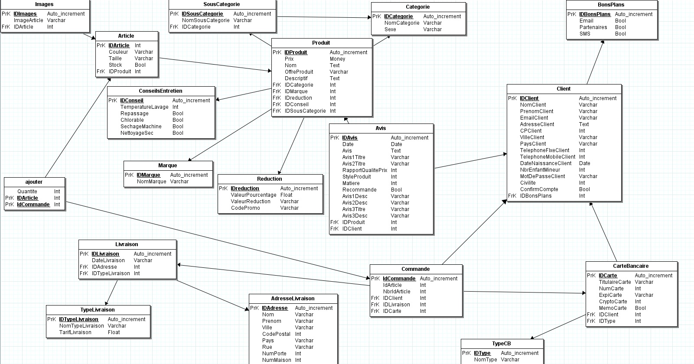

# Avec 1 dièse, c'est le titre Niveau 1

## Avec 2 dièses, c'est le titre Niveau 2

### Avec 3 dièses, c'est le titre Niveau 3

**Entouré de 2 astérisque, texte en gras**

_Entouré d'un underscore, texte en italic_

> Citation Niveau 1
>> Citation Niveau 2


```
    Entouré de 3 accents graves,
    écrire du code


```


# Sommaire


# Le projet

Le projet **Ecommerce** est un projet pédagogique pour la soutenance au titre de Développeur Web & Web mobile réalisé sur **Symfony 7** 

## Technologies

**Ecommerce** sera développé en utilisant :

- Symfony 7
- Mysql 8.0
- PHP 8.2
- PHPMyAdmin
- Sass


## Base de données

